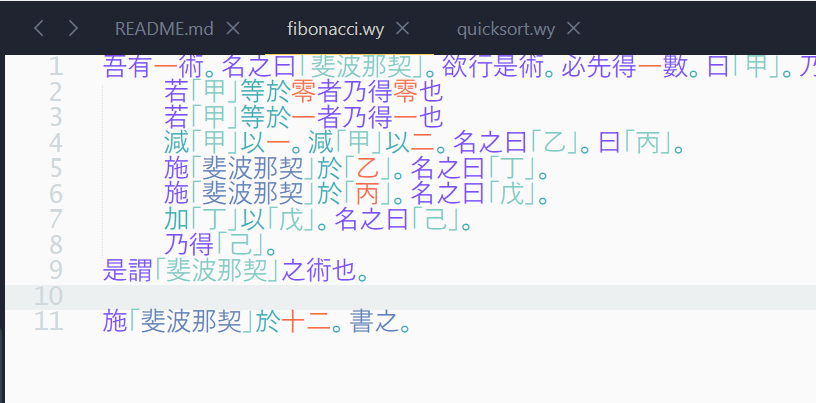
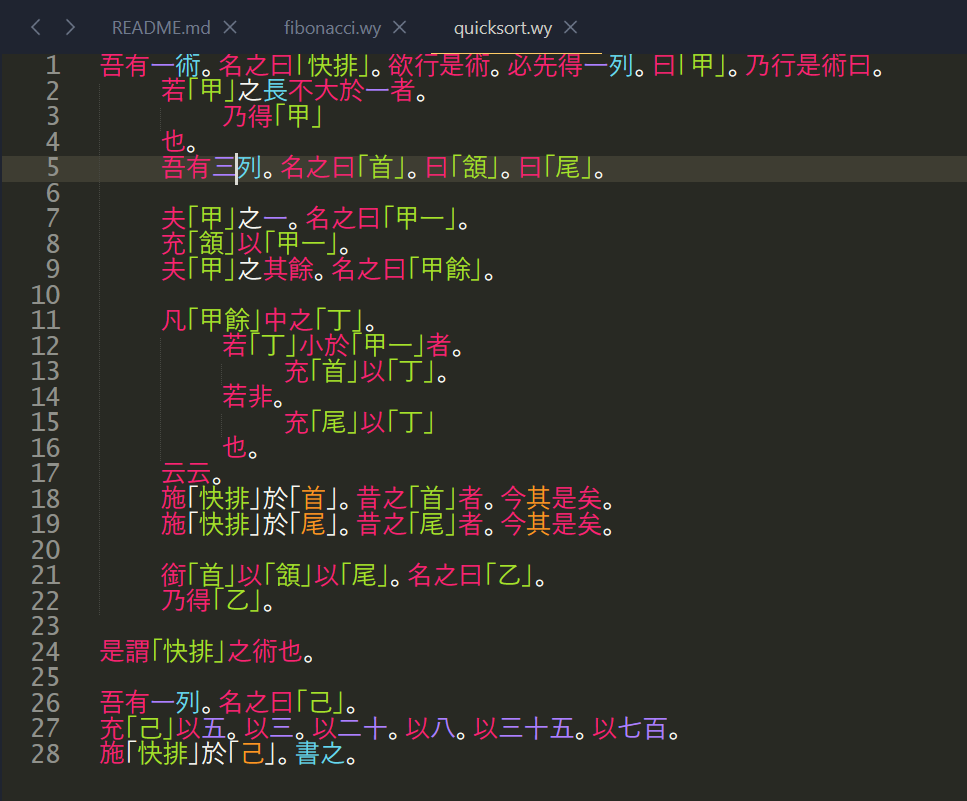

# SublimeWenyan

[README](README.md)

## 使用
1. 按照 Wenyan 的文档编译安装好 Wenyan，并将它的路径添加到环境变量。不要修改编译生成的可执行文件名，保持它的平台后缀不变。

2. 安装本插件，一边你可以在SublimeText中使用它 。

## 截屏

## 计划
- [x] 语法高亮
- [x] 代码运行
- [x] 编译到 JS
- [x] 编译到 Python
- [ ] 代码片段
- [ ] 代码自动补全
- [ ] 数字自动转换

<!-- ## Contributors -->
